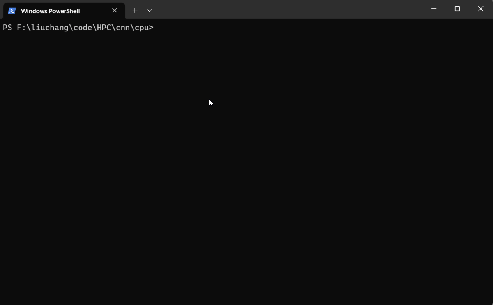

# 简介

2022年初，写的一个简单的 CNN 卷积神经网络训练的 demo，当前版本只是为了验证神经网络前向和反向传播，加深个人理解，暂不涉及高性能优化及模型部署等，目前也只写了 CPU 上的简单实现，后续有计划推出 CPU 优化版本以及 GPU 版本（基于 CUDA）。

知乎博客：https://zhuanlan.zhihu.com/p/468100301


主要实现了一些基础层

- Conv2d 卷积层，不支持 padding
- 最大池化层
- ReLU 层
- Linear 全连接层
- Batch Normalization 层（验证时性能很差，暂未解决）
- Dropout（验证时性能很差，暂未解决）

还有训练流程

- 交叉熵
- 随机梯度下降

还有张量 Tensor 结构的定义、借助 gradCAM 原理可视化等。

# 环境

- Windows 10
- GCC 10.3.0（[TDM-GCC](https://link.zhihu.com/?target=https%3A//jmeubank.github.io/tdm-gcc/download/)）、C++17
- CMake 3.17
- OpenCV 4.5
- XMake  2.7.4（可选）
- [数据集](https://github.com/hermosayhl/CNN/tree/main/datasets) 从[cat-dog-panda](https://link.zhihu.com/?target=https%3A//www.kaggle.com/ashishsaxena2209/animal-image-datasetdog-cat-and-panda) 数据集剔除 cat（cat 和 dog 的分类相对较难），然后又从 [CUB-200 bird](https://link.zhihu.com/?target=http%3A//www.vision.caltech.edu/visipedia/CUB-200.html) 数据集中随机抽出 1000 张鸟类图像，凑成三分类的小型数据集。train : valid : test 比例 8:1:1。

【注意】：

- gcc 版本 >= 10，代码中有 C++17 std::filesystem 的内容；
- CMake 版本可以高一点；
- OpenCV 最好是根据 gcc 在 windows 上编译而成的，以保证顺利链接

如果是 MSVC 做编译器，可以编译一个，也可以直接下载官方编译好的 [OpenCV](https://sourceforge.net/projects/opencvlibrary/files/4.5.5/opencv-4.5.5-vc14_vc15.exe/download)。如果在 Windows 上选择 gcc 做编译器，一般从头编译一个，下面是一个简单的编译流程，关闭了诸多选项（如果 ffmpeg 下载不了，也可以把 WITH_FFMPEG 置为 OFF）。

```bash
mkdir build
cd build
# 编译选项
cmake .. -G "MinGW Makefiles"  -D CMAKE_BUILD_TYPE=RELEASE -D CMAKE_INSTALL_PREFIX=./install -D ENABLE_FAST_MATH=ON -D BUILD_opencv_python2=OFF -D BUILD_opencv_python3=OFF -D BUILD_opencv_python_tests=OFF -D BUILD_opencv_python_bindings_generator=OFF -D BUILD_JAVA=OFF -D BUILD_opencv_java_bindings_generator=OFF -D BUILD_TESTS=OFF -D BUILD_PERF_TESTS=OFF -D BUILD_EXAMPLES=OFF -D BUILD_opencv_world=OFF -D OPENCV_ENABLE_NONFREE=OFF -D OPENCV_GENERATE_SETUPVARS=OFF -D WITH_OPENCL_D3D11_NV=OFF -D WITH_MSMF=OFF -D WITH_CUDA=OFF -D WITH_FFMPEG=OFF
# 构建
mingw32-make -j4
mingw32-make install
# 把 build/install/x64/bin 路径添加到环境变量中, 确保能正确链接
```

# Start

## **Cmake**

进入 [cpu](https://github.com/hermosayhl/CNN/tree/main/cpu) 目录，创建构建目录、生成目录

```bash
mkdir build_cmake
mkdir bin
cd build
```

执行 CMake，生成 Makefiles

```bash
cmake .. -G "MinGW Makefiles"
```

添加 `-G  "MinGW Makefiles"` 是因为我电脑上有 MSVC，会自动优先使用 MSVC，但我更喜欢用 GCC，因此需要加这一条，如果在 linux 上，可以不加这条。

编译构建

```bash
# Windows + GCC
mingw32-make -j4
# Linux + GCC
make -j4
```

我执行的是上一条命令，在 bin 目录下即可看到生成的三个文件


点击 train.exe 即可训练模型


点击 inference.exe ，加载训练好的模型，并对单张图像做推理


点击 gradCAM.exe，尝试 CNN 可视化效果


## Xmake

[Xmake](https://github.com/xmake-io/xmake) 是最近接触的一款很方便的构建工具，构建速度也很快，十分模块化，推荐使用。

先创建 build 目录

```bash
mkdir build
```

指定 mingw 路径（注意修改），很容易检测成 Anaconda 的 mingw

```
xmake g --mingw=F:\liuchang\environments\TDM-GCC
```

使用 mingw 工具链

```bash
xmake f -p mingw
```

构建所有的目标，则

```
xmake build
```

构建其中特定的一个目标 `cnn_train`

```bash
xmake build cnn_train
```

运行目标 `cnn_train`

```bash
xmake run cnn_train
```



重新编译

```bash
xmake -r
```

【MSVC】如果电脑有 visual studio 环境，直接 xmake，不指定 mingw，**修改完 opencv 路径之后**，紧接着 build、run。

【GCC】如果是在 Linux 上，一般有 gcc-10 以上，也是直接 xmake，不用指定，同 MSVC